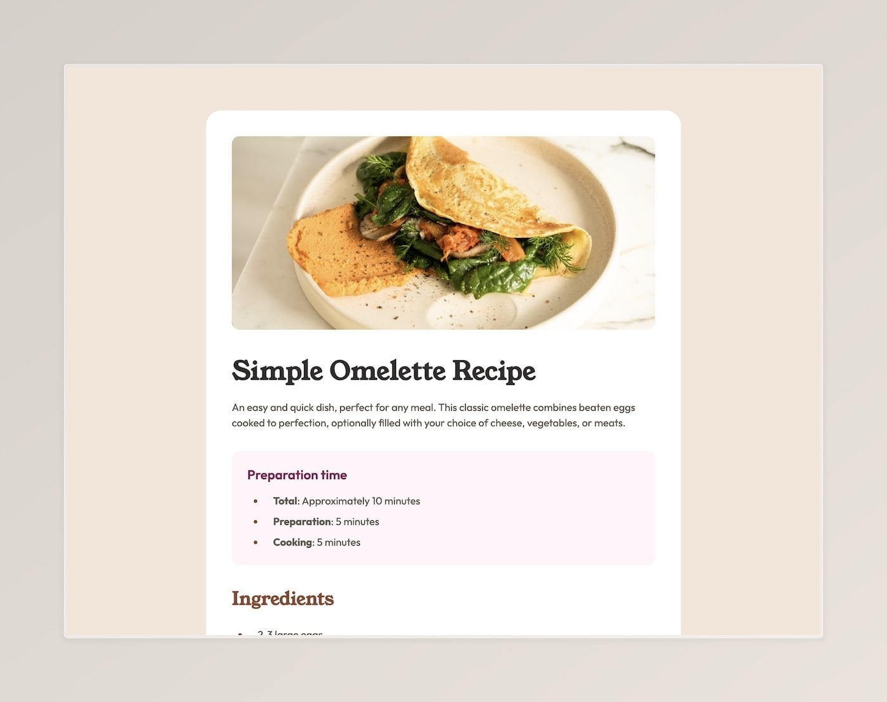

# Frontend Mentor - Recipe page solution

This is a solution to the [Recipe page challenge on Frontend Mentor](https://www.frontendmentor.io/challenges/recipe-page-KiTsR8QQKm). Frontend Mentor challenges help you improve your coding skills by building realistic projects.

### Links

- Solution on [GitHub](https://sydalwedaie/fm-recipe-page.com)
- Live Site URL: [Add live site URL here](https://fm-recipe-page-KiTsR.netlify.app)

## Built with

- Semantic HTML5 markup
- CSS custom properties
- Flexbox
- Fluid Typography
- Fluid Spacing
- Mobile-first workflow

### What I learned

To be able to apply a border property to a table row `tr`, a `border-collapse: collapse` property must be added to the table. Otherwise the border won't show up.

### Useful resources

I made extensive use of this [fluid typography calculator](https://fluidtypography.com/#usarusFluidTypographyGetStarted). But even more interestingly, I used it to calculate fluid paddings too! This way, my media query size jumps would not be as jarring.
